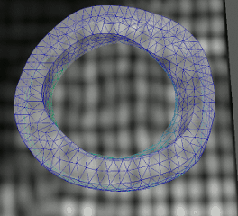

# Eidolon

Eidolon is a biomedical visualization and analysis framework designed to render 
spatial biomedical data (images and meshes) and provide facilities for image reconstruction, 
analysis, and computation. Implemented in Python with rendering provided by the Ogre3D engine, 
Eidolon presents a powerful workbench environment for Windows, OSX, and Linux.

## Visualize Data

| Meshes  | Images   | Combined   |

Eidolon can visualize mesh and image data in 3D, rendering multiple mesh fields and representations with images in the same environment.
Spatial information stored in files is respected thus ensuring spatial relationships are correct.
Many popular file formats are supported (VTK, NIfTI, Dicom, MetaImage).

## View Images in 2D

| Single Image  | Multiple Images  | Image and Mesh  |

Create 2D views in Eidolon to visualize individual image planes and the data they intersect with.
Meshes passing through images can be visualized as isolines, and other images can be overlaid to allow the user to assess spatial correlation.

## Visualize in Time

| Meshes  | Images   | Combined   |

Mesh and image data which is time dependent can be rendered in Eidolon simultaneously.
Timing information is read from input data to ensure data correlates temporally during playback.

## Process Data

| Script Interface  | Python Console   | Image Processing Projects  |

Eidolon exposes its internal data structures and algorithms to user scripts which can be loaded at runtime.
This allows custom processing of loaded data to be performed which can import additional libraries.
The runtime Python console allows users to probe and experiment with loaded data, allowing Eidolon to function as a workbench environment.
Image processing projects expose IRTK/MIRTK functionality for image registration, alignment, motion tracking, and other image processing tasks. 

## Extend Platform

| Custom Code  | Custom UI  | Plugin Interface |

Write custom modules and scripts to extend the capabilities of Eidolon. 
New user interfaces can be easily imported using PyQt to provide custom interactive components.
The plugin-oriented architecture allows the extension of virtually all aspects of the platform, permitting new
plugins to be created to import file formats, implement algorithms, and process data.

## Screenshots

<a class="slide-btn display-left" onclick="plusDivs(-1)">&#10094;</a>
<a class="slide-btn display-right" onclick="plusDivs(1)">&#10095;</a>

	

	  
	  
Cardiac mesh with fields

	

	
	

	  
	  
Cardiac mesh rendered with images

	

	
	

	  
	  
Eidolon interface

	

	
	

	  
	  
Segmentation interface

	

---

|  |  |  |  |  | 

Copyright (c) 2016 Eric Kerfoot <eric.kerfoot@kcl.ac.uk>, King's College London, all rights reserved