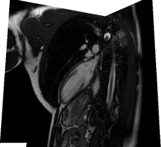

Eidolon is a biomedical visualization and analysis framework designed to render spatial biomedical data (images and meshes) and provide facilities for image reconstruction, analysis, and computation.

| Render meshes multiple lines |  |

|  | Render images|

| Render meshes with images |  |

